# 🌸 **EmpowHER: Empowering Women Worldwide** 🌸

Welcome to **EmpowHER**, a one-stop platform designed for women, by women. We are connecting women globally and empowering them through personalized tools, real-time support, and communities. Whether you’re navigating your health journey, balancing your life, or seeking connections across the globe, **EmpowHER** is here to support you at every step. 💪✨

## Live Demo

Try the website with the link below:

[EmpowHER Website](https://empow-her-seven.vercel.app/)


---

## 🚀 **Features that Empower You!**

Here’s a sneak peek into the exciting features we offer:

### 🤖 **Smart Chatbot**  
Meet our AI-driven **EmpowHER Bot**, your personal guide and companion on this platform!  
- Offers personalized responses.  
- Helps navigate the platform.
- Provides useful health insights and tips.

### 🧘‍♀️ **Work-Life Balance Tracker**  
Our **Work-Life Balance Tracker** will help you strike that perfect balance between your career and personal life:  
- Track daily activities and routines.  
- Get insights into where your time is going and how to optimize it.  
- Maintain a healthy, productive lifestyle.

### 🩺 **Personalized Health Trackers**  
Monitor your menstrual cycle, mental well-being, and physical health with ease:
- **Menstrual Cycle Tracker** helps you stay informed about your cycle and symptoms.  
- **Mental Health Tracker** gives you insights into your mood patterns, helping you manage stress and anxiety.

### 🌍 **Global Communities & Real-Time Chat Room**  
Feel connected, wherever you are! Join our real-time chat room to connect with women worldwide, exchange experiences, and get support.  
- Real-time conversations.  
- Community-driven topics around health, careers, mental well-being, and more.

### 📚 **Informative Articles**  
Access a treasure trove of articles written by experts on topics ranging from wellness to professional development.  

### ✈️ **Explore Travel & STEM**  
Engage with resources designed for women who are passionate about travel and STEM. Be inspired by women breaking barriers in science, technology, and exploration!

---


## 💻 **Technologies Used** 🔧

We believe in using cutting-edge technologies to provide the best experience:

- **React** ⚛️: For building a highly responsive, dynamic, and beautiful user interface.
- **Framer Motion** 🎥: To give life to our UI with smooth animations.  
- **Tailwind CSS** 🎨: For sleek, modern design with minimal effort.  
- **Node.js** 🌍: Backend operations to support real-time interactions.
- **Socket.IO** 🔄: Powers the real-time chat functionality.
- **Supabase** 🔧: For database management and authentication. Supabase uses **PostgreSQL** 🐘, a powerful open-source relational database, as its underlying database engine for handling structured data and ensuring data integrity with ACID compliance.
- **API Integration** 🔗: Custom-built health insights APIs.
- **Google’s Generative AI** 🧠: For advanced natural language processing and health insights generation.

Our tech stack ensures scalability, speed, and security, so you can focus on your journey while we handle everything behind the scenes! 🌟


---


# 🌍 **EmpowHER** - Your Health, Wellness, and Community Hub 🌸

Welcome to **EmpowHER**, a platform designed to connect women across the globe. Explore tools for tracking your health, articles, communities, and more.

## 📸 **Website Walkthrough** 🌟

### 1. Title & Chatbot 🤖
At the very top, you're greeted with our **smart chatbot** that assists with personalized interactions. It's user-friendly, intuitive, and helps you get answers in real-time.

&nbsp;

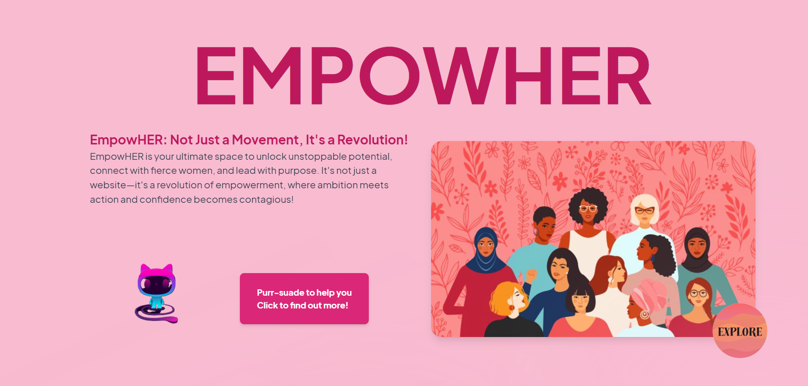
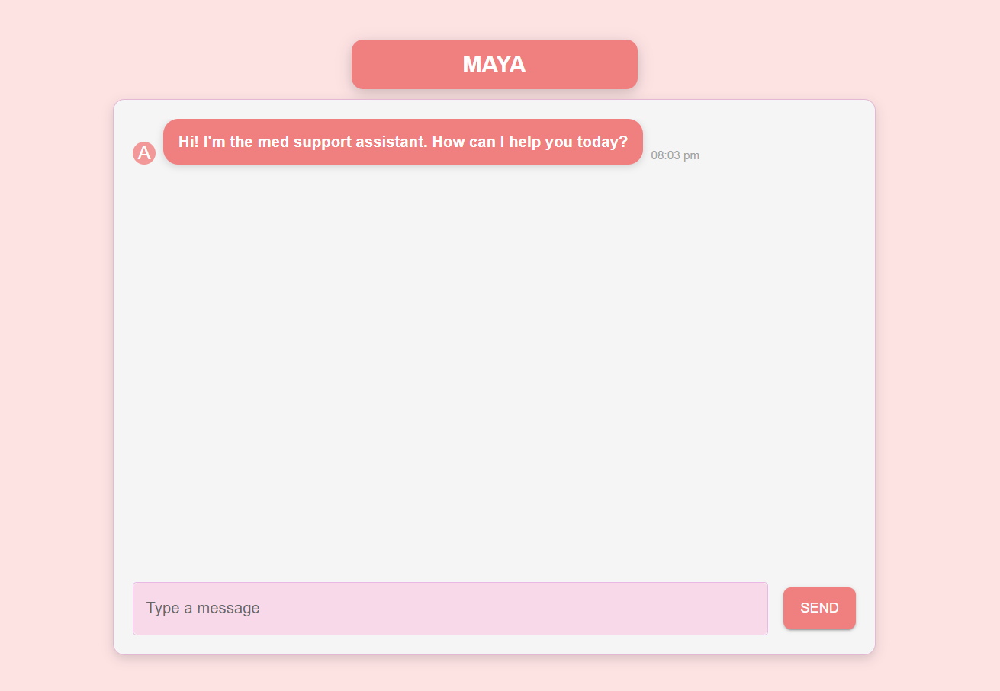
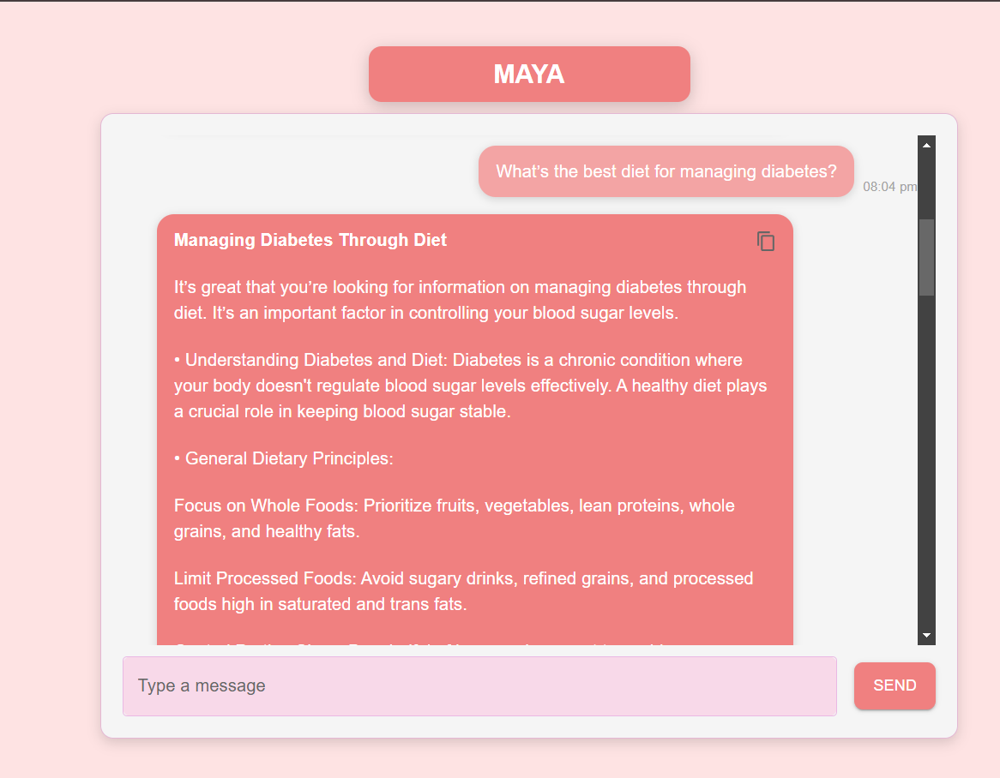

---

### 2. **Work-Life Balance Tracker** 📊
**Manage your time efficiently** with our easy-to-use work-life balance tracker. Keep track of how you're spending your days and ensure you’re prioritizing yourself.

&nbsp;

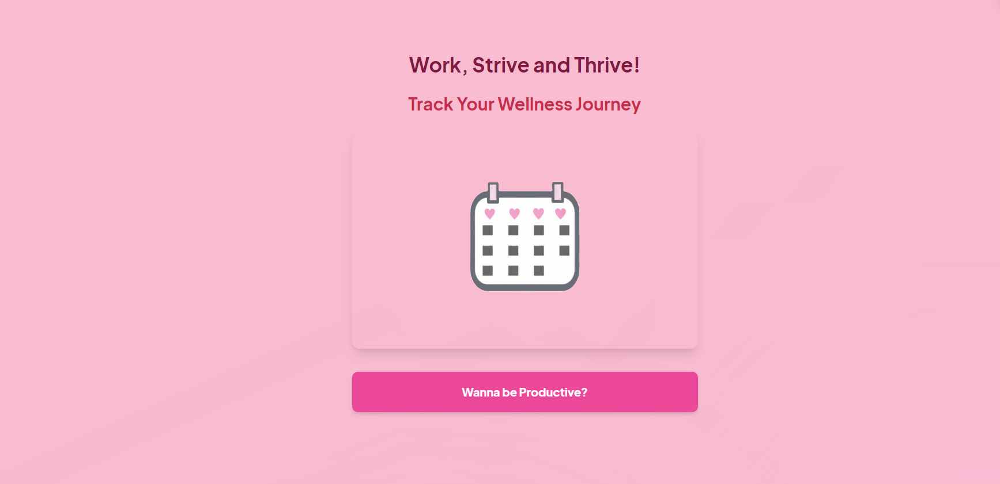
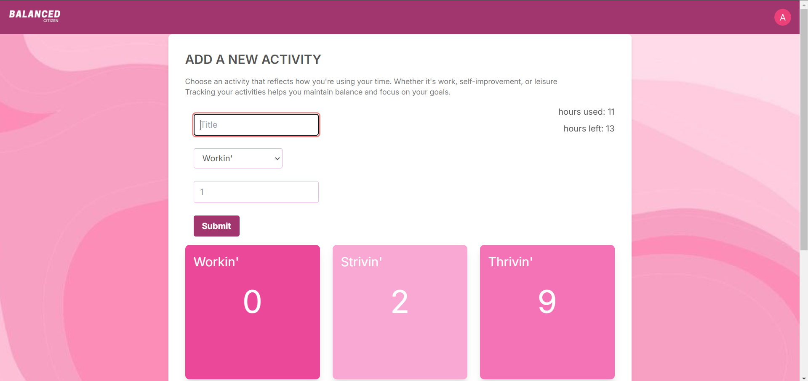
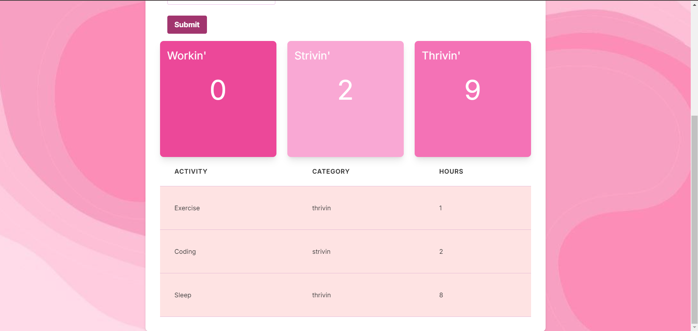

---

### 3. **Brief Description** ✨
A welcoming introduction to **EmpowHER**, giving you a quick overview of the platform’s mission to empower women.

&nbsp;

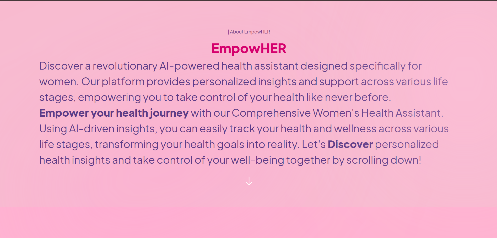

---

### 4. **Articles Section** 📚
Browse insightful **articles** that provide tips and advice on wellness, personal growth, and career development.

&nbsp;


---

### 5. **Menstrual Cycle & Mental Health Trackers** 🩺
Stay on top of your **health** by using our trackers for **menstrual cycles** and **mental well-being**. Get personalized insights to better understand your body and mind.

&nbsp;

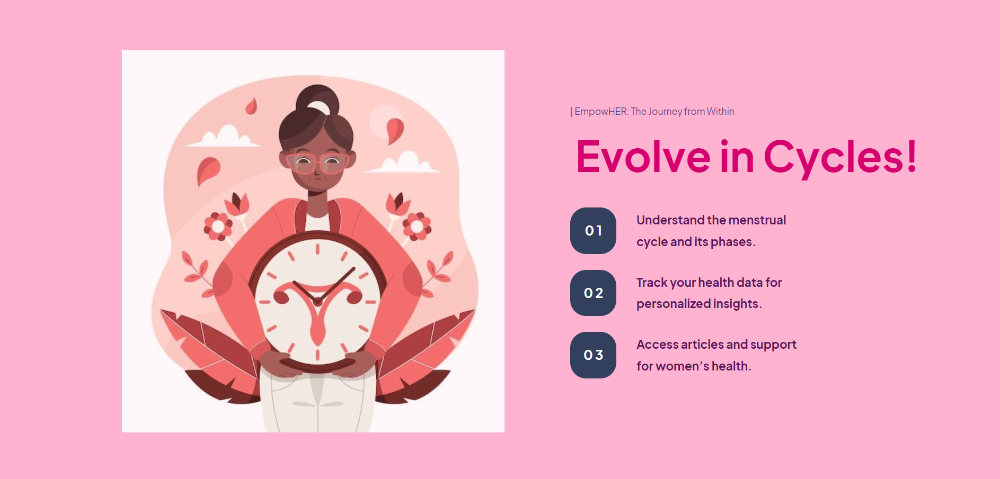


---

### 6. **Communities & Chat Room** 🌍
Connect with women globally through the **real-time chat room**. Share experiences, discuss topics, and feel supported in our diverse and engaged community.

&nbsp;

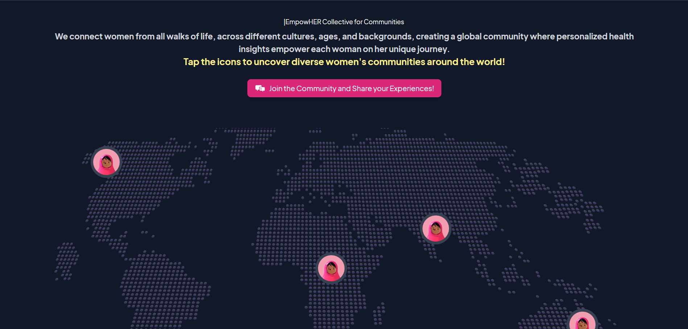
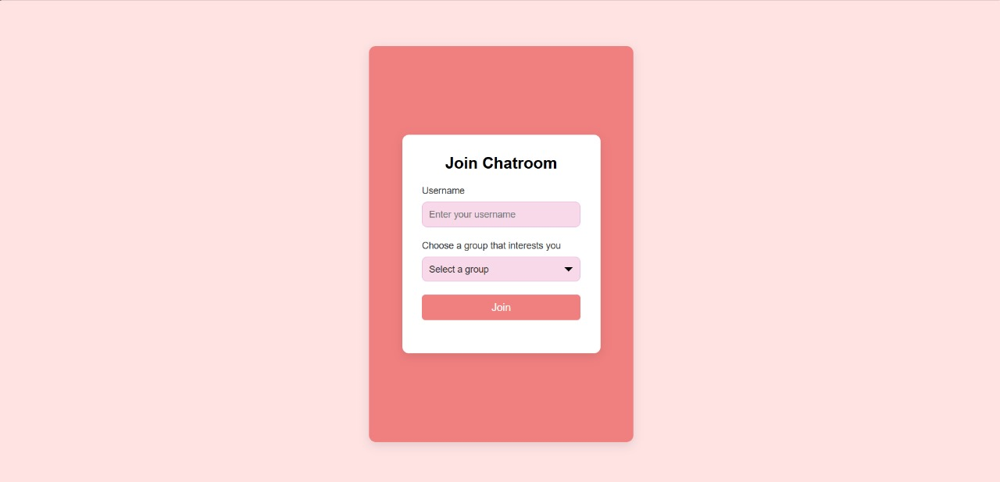
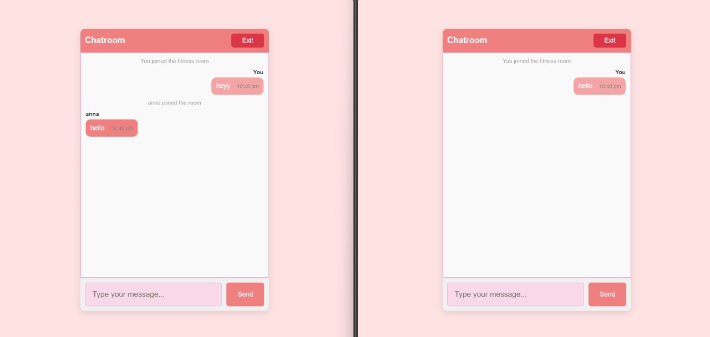


---

### 7. **Travel & STEM Sections** ✈️👩‍🔬
Explore resources and communities for **women in travel** and **STEM** (Science, Technology, Engineering, and Math) to discover new opportunities and stories.

&nbsp;


---


## 🔗 **Live Links & Repositories**

Experience **EmpowHER** firsthand:

- 🤖 **Live Chatbot**: [Chatbot Deployment Link](https://ai-women-health-assisstant.vercel.app/)
- 💬 **Work-Life Balnace Tracker**: [Chat Room Deployment Link](https://balance-tracker-nine.vercel.app/)

For developers looking to dive into the code, here are the separate repositories:

- **Chatbot Repository**: [Chatbot GitHub Repo](https://github.com/Bhaanavee/Womens_Health_Assistant_chatbot)  
- **Chat Room Repository**: [Chat Room GitHub Repo](https://github.com/Bhaanavee/chat_app)
- **Balance Tracker Repository** : [BalanceTracker Github Repo](https://github.com/Bhaanavee/Balance_tracker)

---

## 🛠️ **Installation & Setup**

Want to set up **EmpowHER** on your machine? It’s as simple as 1-2-3! 🚀

### Step 1: Clone the Repositories  
Start by cloning the main website repo:
```bash
git clone https://github.com/Bhaanavee/empowHER.git
```

### Step 2: Install Dependencies  
Navigate into the project directory and install the required packages:
```bash
cd empowher
npm install
```

### Step 3: Run the Application  
Run the development server:
```bash
npm run dev
```

And you’re all set! 🚀 Enjoy exploring **EmpowHER** locally.

---

## 🌍 **Contributing**

We’d love to have more women in tech contribute to **EmpowHER**! 💻  
- Fork the repo, create a new branch, and submit a pull request.  
- We appreciate all suggestions and ideas that help make this platform better.

---

## 💬 **Contact Us**

Have any questions, or suggestions, or just want to chat? Feel free to reach out:  
📧 **Email**: [Mail us ](mailto:bhanavee123@gmail.com)

Let’s work together to make the world a better place for women everywhere! 🌟

---

## 🎉 **Let’s Get Empowered!** 🎉

We’re so excited to have you here! With **EmpowHER**, you’re not just joining a platform; you’re becoming part of a global movement focused on supporting, connecting, and empowering women across the globe. 💪🌸

# empowHER
